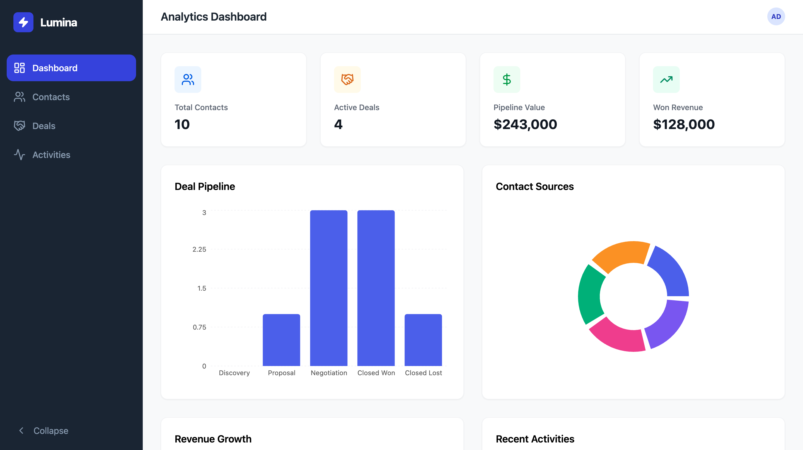

# Lumina Agency CRM

A functional CRM (Customer Relationship Management) system with an Analytics Dashboard, purpose-built for ad agency workflows. Built as part of the Byteable AI Engineering Challenge.

## Live Preview



**Analytics Dashboard** — Real-time KPIs, deal pipeline visualization, contact source breakdown, revenue trends, and recent activity feed.

**Contact Management** — Full CRUD operations with search, filtering, and status tracking across the client lifecycle (Lead → Prospect → Client → Churned).

**Deal Pipeline** — Kanban-style stage management (Discovery → Proposal → Negotiation → Closed Won / Closed Lost) with currency-formatted values and contact association.

**Activity Tracking** — Chronological feed of calls, emails, meetings, notes, and tasks with completion toggles and overdue highlighting.

---

## Tech Stack

| Layer | Technology |
|-------|-----------|
| Frontend | React 19, TypeScript, Vite |
| Styling | Tailwind CSS, Framer Motion |
| State Management | Zustand (UI state) |
| Data Tables | TanStack React Table |
| Charts | Recharts (Bar, Pie, Area, Line) |
| Backend | Supabase (PostgreSQL + REST API) |
| Icons | Lucide React |
| Date Utilities | date-fns |

---

## Architecture

```
src/
├── components/        # Reusable UI components (Layout, Sidebar, StatsCard)
├── hooks/             # Custom hooks encapsulating all Supabase CRUD logic
│   ├── useContacts.ts
│   ├── useDeals.ts
│   └── useActivities.ts
├── pages/             # Page-level components (Dashboard, Contacts, Deals, Activities)
├── store/             # Zustand store for UI state (active page, sidebar toggle)
├── lib/               # Supabase client initialization
├── types/             # TypeScript interfaces (Contact, Deal, Activity)
├── App.tsx            # Root component with page routing via Zustand
├── main.tsx           # Entry point
└── index.css          # Tailwind directives
```

### Key Design Decisions

- **Custom hooks own all data logic.** Components never call Supabase directly. This keeps the UI layer pure and makes the data layer independently testable and swappable.
- **Zustand for UI state only.** Server data lives in hooks via `useState` + `useEffect`. No over-engineering with React Query or Redux for an MVP — simple, readable, and sufficient.
- **Single-page app without a router.** Zustand's `activePage` state drives page rendering. For 4 pages, this is simpler and faster than adding React Router as a dependency.
- **Supabase with Row Level Security.** RLS is enabled on all tables with permissive policies for the anon role. In production, these would be scoped to authenticated users.

---

## Database Schema

Three normalized tables with proper constraints and foreign key relationships:

**contacts** — Client lifecycle tracking with status (lead, prospect, client, churned) and acquisition source (referral, website, social, direct, event).

**deals** — Sales pipeline with monetary values, stage tracking, and contact association. Stages: discovery, proposal, negotiation, closed_won, closed_lost.

**activities** — Interaction log with type classification (call, email, meeting, note, task), completion status, and optional contact/deal association.

Full migration SQL including seed data is available at `supabase/migrations/20250101000000_initial_schema.sql`.

---

## Setup & Installation

### Prerequisites

- Node.js 18+
- A free Supabase account ([supabase.com](https://supabase.com))

### 1. Clone the repository

```bash
git clone https://github.com/yasshh17/lumina-agency-crm.git
cd lumina-agency-crm
```

### 2. Configure environment variables

```bash
cp .env.example .env
```

Edit `.env` with your Supabase project credentials:

```
VITE_SUPABASE_URL=https://your-project.supabase.co
VITE_SUPABASE_ANON_KEY=your-anon-key-here
```

Find these at: Supabase Dashboard → Settings → API

### 3. Set up the database

Open your Supabase project's **SQL Editor** and run the contents of:

```
supabase/migrations/20250101000000_initial_schema.sql
```

This creates all tables, enables RLS, and inserts realistic seed data.

### 4. Install dependencies and run

```bash
npm install --legacy-peer-deps
npm run dev
```

The app will be available at `http://localhost:5173`.

---

## Features Breakdown

### Analytics Dashboard
- 4 KPI stat cards: Total Contacts, Active Deals, Pipeline Value, Won Revenue
- Deal Pipeline bar chart showing deal count per stage
- Contact Sources donut chart showing acquisition channel distribution
- Revenue Growth area chart tracking closed-won deal values over time
- Recent Activities feed with type icons and relative timestamps

### Contact Management
- Searchable table with TanStack React Table
- Color-coded status badges (green = client, yellow = prospect, blue = lead, red = churned)
- Add/Edit modal with form validation
- Delete with confirmation
- All operations persist to Supabase in real-time

### Deal Pipeline
- Kanban-style column view grouped by stage
- Each card displays: title, currency-formatted value, associated contact, expected close date
- Stage management via dropdown (move deals between stages)
- Toggle between Pipeline and Table views
- Green highlight for Closed Won, red for Closed Lost

### Activity Feed
- Filterable by type (calls, emails, meetings, notes, tasks)
- Completion toggle with real-time Supabase sync
- Overdue task highlighting (red indicator for past-due incomplete items)
- Log new activities with contact/deal association

---

## AI Usage

This project was built using the Byteable AI ecosystem (Web IDE + VS Code Extension) to accelerate development:

- **Architecture scaffolding** — AI-assisted generation of the initial project structure, component hierarchy, and database schema design.
- **Code generation** — Custom hooks, page components, and Supabase integration code were generated with AI assistance and then reviewed and refined manually.
- **Debugging** — AI-assisted diagnosis of dependency conflicts (React 19 peer deps) and configuration issues (PostCSS/Tailwind pipeline).
- **Iterative refinement** — Multiple rounds of AI-guided improvements to the layout, styling, and data visualization components.

---

## Scripts

| Command | Description |
|---------|-------------|
| `npm run dev` | Start development server |
| `npm run build` | TypeScript check + production build |
| `npm run preview` | Preview production build locally |

---

## License

This project was built as part of the Byteable AI Engineering Challenge assessment.